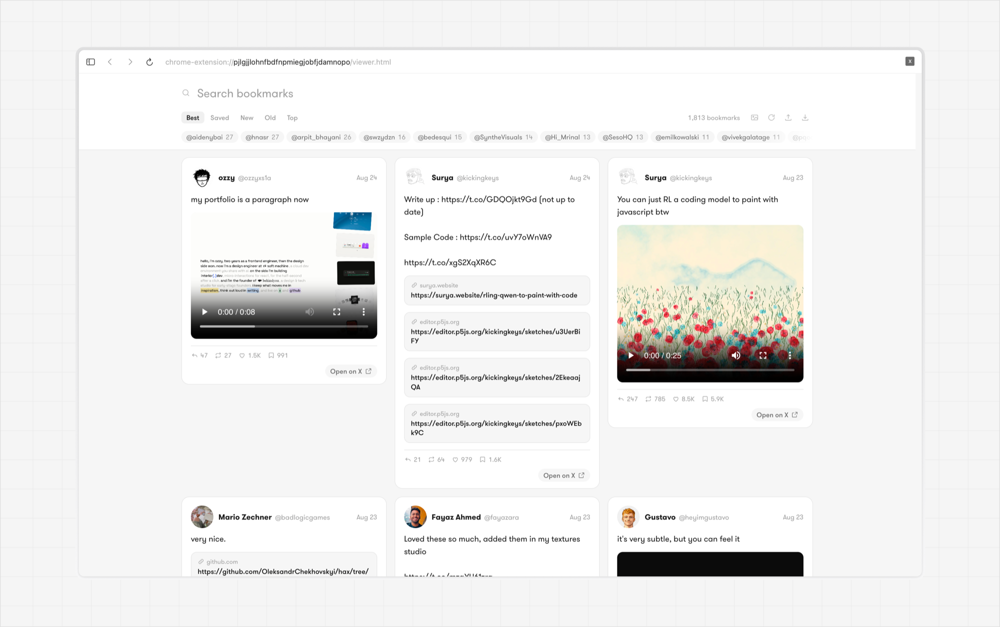

# Dogear

Your X bookmarks, out of X and into something you can actually search.



A bookmark on X is easy to make and nearly impossible to find again — no search worth
the name, no sorting, and a list that only goes one way: down, forever. And going in to
look for one thing means opening X, which rarely ends with finding the one thing.

Dogear is a Chrome extension that collects the lot and gives you a real reader over
them. Everything stays on your machine.

---

## Install

**The easy way.** Download `x-bookmarks.zip` from
[Releases](../../releases/latest) and unzip it. In Chrome, open `chrome://extensions`,
turn on **Developer mode** (top right), then **Load unpacked** → the unzipped folder.

**From source**, if you would rather build it yourself:

```bash
cd x-bookmarks
npm install
npm run build      # writes dist/, which is the folder to load
```

## Use it

1. Open your bookmarks on X — `x.com/i/history`, the page that used to be
   `x.com/i/bookmarks`.
2. Click **Scrape bookmarks** at the bottom right of the page, and leave the tab in
   front while it scrolls.
3. Click the extension icon → **Open library**.

Scraping again later is safe and additive. Rows are keyed by post id, so a second run
updates what changed and adds what is new. Nothing is duplicated, and nothing you have
removed comes back.

## What it can do

- **Search that means something.** `from:swyx`, `has:video`, `is:quote`, `min:500`,
  `after:2024-01-01`, `"exact phrase"`, and plain words — combined however you like.
- **Sort by when you bookmarked it**, which X itself will not show you. The order is
  carried in a key X sends with each timeline entry; nothing on the post records it.
- **Link previews**, fetched and cached so a bookmark that is mostly a bare URL is
  readable. Off until you turn them on, because they need a permission the extension
  does not otherwise hold.
- **Export** to JSON, CSV or Markdown. They are your bookmarks.

## How it works, and what it does not do

The extension reads the bookmark data **X already sends your browser**. It watches the
responses the page fetches as you scroll and keeps the posts out of them. It does not
craft API calls, hold credentials, or know any GraphQL query ids — which is also why it
does not break every time X changes one.

Nothing leaves your machine. The library lives in `chrome.storage.local`. There is no
server, no account, and no telemetry. The only outbound requests are for link previews,
once you switch them on.

**Removing a bookmark in Dogear does not remove it from X.** The two are separate; this
never writes to your account.

## A note on X's terms

This reads your own bookmarks, out of responses X has already sent to your own browser,
by scrolling the page the way you would. It adds no requests X was not going to make.
Automating any part of a site can still sit badly with its terms of service, and that is
a judgement to make for yourself before you run it.

## Known limitation

The page-world script hands timeline data to the extension over `window.postMessage`.
Any script running on x.com could forge one of those messages and put fabricated rows in
your library. Closing that needs a shared secret the static script cannot carry — and
anything able to run code on x.com can already read your whole timeline. Worth knowing;
not worth alarm.

## Development

```bash
cd x-bookmarks
npm install
npm run dev     # vite dev server, HMR on the viewer
npm test        # search, normalisation, Open Graph parsing
```

## Licence

MIT, for the code.

Typeset in [Inter](https://rsms.me/inter/) and [JetBrains Mono](https://www.jetbrains.com/lp/mono/),
both under the SIL Open Font License and bundled here with it.
